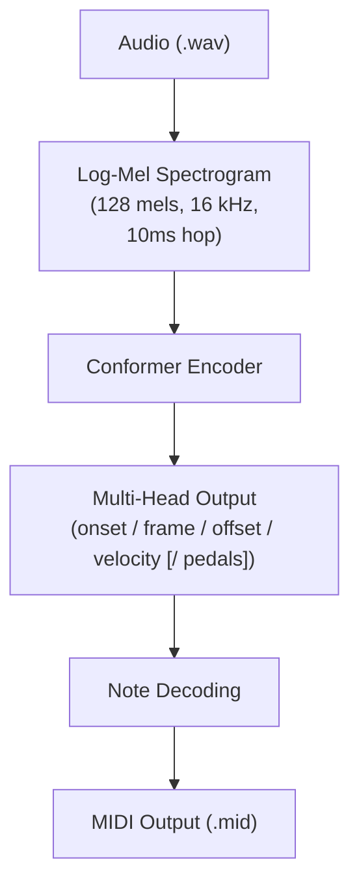

# Automatic Music Transcription with Conformer Architecture

This is a system for Automatic Music Transcription (AMT) that converts piano audio into MIDI files. Two conformer-based models are implemented and trained on the MAESTRO v3.0.0 dataset. 

## Overview
This was made for my final project during my Masters in Applied AI and UX. This project takes a piano audio recording (.wav) and outputs a .mid (MIDI) file with predicted note onsets, offsets, pitches, and velocities. There are two models that have been trained and evaluated. I'm making this as step-by-step as possible, because it's what I would have wanted when I started making this :,)

The pipeline is:

## Models
### Model A - Base Conformer
A 6-layer Conformer encoder (384-dim, 6 heads) that predicts note onsets, frames, offsets, and velocity from log-mel spectrograms. Frame predictions are conditioned on onset outputs via a learned projection, using teacher forcing during training.

**Outputs:** ``onset``, ``frame``, ``offset``, ``velocity``
### Model B - Pedal Conformer
The same Conformer backbone, extended to additionally predict sustain (CC64) and una corda (CC67) pedal states alongside velocity. Pedal outputs are decoded with hysteresis and debounce logic to produce stable CC events in the output MIDI.

**Outputs**: ``onset``, ``frame``, ``offset``, ``velocity``, ``sustain pedal (CC64)``, ``una corda pedal (CC67)``

Both models use the same training setup: AdamW optimiser, mixed-precision training, 40 epochs, batch size 8, and 8-second random crops (800 frames at 100 Hz).
## Project and File Structure
```yaml
amt_project/
│
├── preprocess/
│   ├── build_dataset.py            # Converts raw audio + MIDI into NPZ feature files
│   ├── upgrade_velped_npz.py       # Adds velocity and pedal targets to existing NPZs
│   ├── dataset.py                  # Base dataloader (onset/frame/offset)
│   ├── dataset_upgrade.py          # Dataloader for Model A (+ velocity)
│   └── dataset_velped_upgrade.py   # Dataloader for Model B (+ velocity, pedals)
│
├── model/
│   ├── onset_conformer_amt.py      # Model A architecture
│   └── velped_conformer_amt.py     # Model B architecture
│
├── training/
│   ├── onset_train.py              # Training script for Model A
│   └── velped_train.py             # Training script for Model B
│
├── inference/
│   ├── decode_onsets_vel.py        # Decode Model A outputs -> MIDI
│   ├── decode_velped.py            # Decode Model B outputs -> MIDI (with pedals)
│   ├── evaluate_onsets_vel.py      # Evaluate Model A
│   └── evaluate_velped.py          # Evaluate Model B
│
├── data/
│   └── maestro-v3.0.0/             # MAESTRO dataset (not in git)
│
├── preprocessed/                   # Generated NPZ files (not in git)
├── checkpoints/                    # Saved model weights (not in git)
│
└── README.md
```
## Installation Guide
### Prerequisites
- Python 3.11
- CUDA-capable GPU (optional but recommended)
- [Conda](https://docs.conda.io/en/latest/)
### Guide
**1. Clone the repository**
```bash
git clone https://github.com/mushroomcodes/automatic-music-transcription.git
cd automatic-music-transcription
```
**2. Create and activate a conda environment**
```bash
conda create -n amt python=3.11 -y
conda activate amt
```
**3. Install PyTorch with CUDA support**
```bash
pip install torch torchvision torchaudio --index-url https://download.pytorch.org/whl/cu121
```
**4. Install other dependencies**
```bash
pip install librosa pretty_midi miditoolkit numpy scipy pandas tqdm matplotlib einops
pip install tensorboard
```
**5. Verify GPU availability**
```python
import torch
print("CUDA available:", torch.cuda.is_available())
print("Device name:", torch.cuda.get_device_name(0))
print("Total memory (GB):", torch.cuda.get_device_properties(0).total_memory / (1024**3))
pip install spyder # I used spyder :) so optional ofc
```
## Usage Guide
Thanks for bearing with me so far! Now onto the good part.

**1. Download the dataset**

Download [MAESTRO v3.0.0](https://magenta.withgoogle.com/datasets/maestro#v300) and place it at:
```
amt_project/data/maestro-v3.0.0/
```
This folder should contain the `maestro-v3.0.0.csv` metadata file alongside the audio and MIDI subdirectories.

**2. Preprocess**

**Step 1:** Build base NPZ files (log-mel spectrogram + onset/frame/offset targets):
```bash
python preprocess/build_dataset.py
```

Edit the `ROOT` path at the bottom of the script to point to your MAESTRO directory. This produces `.npz` files for training, validation, and test splits.

**Step 2:** Upgrade NPZs with velocity and pedal targets (required for Model B)
```bash
python preprocess/upgrade_velped_npz.py
```

This reads the base NPZs and adds `vel_on`, `ped64`, `ped66`, and `ped67` arrays. I originally also included the `cc66` sostenuto pedal, but didn't use it in the end as there were VERY few examples to train on.

**3. Train**

**Train Model A** (onset + velocity)
```bash
python training/onset_train.py
```

**Train Model B** (onset + velocity + pedals)
```bash
python training/velped_train.py
```

Both scripts automatically resume from the last checkpoint if one exists. Best checkpoints are saved separately. Update the `TRAIN_DIR`, `VAL_DIR`, and `TEST_DIR` paths at the top of each script before running.

**4. Decode to MIDI**

**Model A:**
```bash
python inference/decode_onsets_vel.py
```

**Model B:**
```bash
python inference/python inference/decode_velped.py.py
```

Update the `CKPT`, `NPZ_DIR`, and `OUT_DIR` paths at the bottom of each script. Both process an entire folder of NPZ test files and write one `.mid` per track.

**5. Evaluate**

Evaluation is run against the original MAESTRO MIDI ground truth. Metrics reported are note-level precision, recall, and F1 for onset-only and onset+offset matching, plus a velocity F1 score.

**Model A:**
```bash
python inference/evaluate_onsets_vel.py
```

**Model B:**
```bash
python inference/evaluate_velped.py
```

Uipdate `DATA_ROOT`, `CSV`, and `PRED_DIR` at the bottom of each script to point to your MAESTRO directory and decoded MIDI output folder.
## Acknowledgements

 - Dataset: [MAESTRO v3.0.0](https://magenta.withgoogle.com/datasets/maestro#v300) - Hawthorne et al., 2019
 - [`torchaudio`](https://pytorch.org/audio/) Conformer implementation
 - [`pretty_midi`](https://craffel.github.io/pretty-midi/) for MIDI I/org
 - [`librosa`](https://librosa.org/) for audio feature extraction
 - [readme.so](https://readme.so/) for helping me create THIS README in a way that I could visualise it too!

 ***THE END!***
